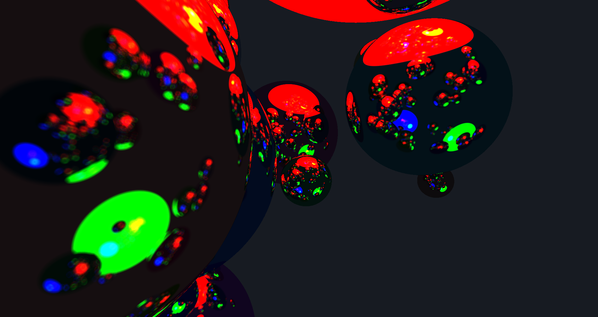

# Raytracer

A GPU raytracer created to explore Vulkan, compute shaders, and the basics of ray tracing. It uses Vulkan’s compute shaders to accelerate ray tracing computations on the GPU, enabling real-time rendering of scenes with realistic lighting. The project also integrates ImGui for a simple user interface that allows interactive control over the camera and rendering settings.



## Quick Start

### Run the project

> [!WARNING]
> You need to have [Vulkan SDK](https://vulkan.lunarg.com/sdk/home) installed !

```console
$ .\configure.bat //setup cmake
$ .\run.bat
```

_The project has only been tested on Windows_

## Controls

- `z`, `q`, `s`, `d` - move around,
- `a`, `e` - move up and down
- `r` - reset scene,
- `left_click` - move camera around

## Features

- [x] GPU Raytracing
- [x] Accumulation image
- [x] GUI
- [x] Scene saving
- [ ] Improved PBR
- [ ] Loading .obj models
- [ ] Skybox support
- [ ] BVH implementation

## Reference

- https://raytracing.github.io/books/RayTracingInOneWeekend.html
- https://vulkan-tutorial.com/Introduction
- https://www.scratchapixel.com/
